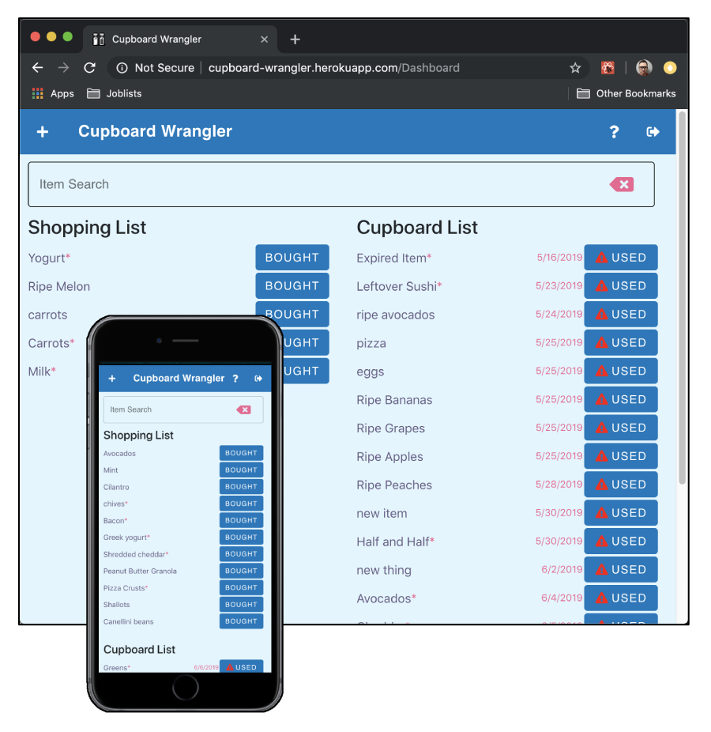

# Cupboard Wrangler

An enhanced shopping list app

## Motivation and User Story

My wife and I are on entirely different schedules.  Oftentimes chores are done by one while the other is either at work or sleeping.  This creates problems when it comes to groceries and our cupboard.  Miscommunications will occur regarding food shopping where one of us will not buy something that the other needs, or we'll both buy it because or a communication breakdown.  Another compounding factor is that if one of us buys something that the other is unaware of, often times it will languish in the pantry or refridgerator and go bad before it gets eaten.  No other pantry/grocery list app that I've found takes "best by" dates into account or toggles grocery items between a grocery list and a pantry inventory list that lets you know what's going bad and when (thus alerting the user when it should be eaten), so I set out to build my own.

### Current Features

* Items placed on the shopping list can be toggled into pantry inventory when purchased and back onto the shopping list when they need replacing
* Shelf life attribute that allows a user to enter an item's shelf life in days to indicate when an item is expected to expire.  If an object is toggled between the pantry and cupboard list, the shelf life is reset relative to the current day
* Items in pantry inventory are sorted by date with older items rendering higher in the list
* The search field highlights items in either the pantry or shopping list and quickly lets a user know its status
* The list is hosted on firebase and authenticated via a user's Google account so data can be persisted between devices

### Planned Features

* Additional item attributes, such as whether an item is grocery or a household item with a seperate list that displays different attributes (ie, laundry detergent doesn't need a shelf life)
* Integration of a coupon API to highlight items in the shopping list that are on sale
* Add a 'preferred vendor' attribute to items in the grocery list if a user buys different items from different vendors.  ie, if you buy specialty items from New Seasons, standard groceries from Winco and household items from Target only items associated with the corresponding vendor will render in that particular shopping list of the chosen store
* Integration with a recipie API to allow a user to add missing ingredients of selected dishes to the shopping list

## Technologies Used

* HTML5/CSS3
* Javascript / ES6 / ES7
* JSX
* Node.js
* React v16 / ReactDOM v16
* React Router
* Redux
* Jest
* React-Redux
* Express

## Known Bugs

* ~Date object needs refactoring.  Items' best by dates don't take year into account, so an object with an expration of 1/2/20 will render higher on the list than an item with an expiration of 1/3/19~ _fixed: 5/8/19_
* Responsive layout is presently less than ideal on mobile devices in portrait mode

## 

**[Github Repository](https://github.com/MattSmithereens/Cupboard-Wrangler)**

**[Heroku site](https://cupboard-wrangler.herokuapp.com/)**

________________

This project was bootstrapped with [Create React App](https://github.com/facebook/create-react-app).

## Available Scripts

In the project directory, you can run:

### `npm start`

Runs the app in the development mode. 
Open [http://localhost:3000](http://localhost:3000) to view it in the browser.

The page will reload if you make edits. 
You will also see any lint errors in the console.

### `npm test`

Launches the test runner in the interactive watch mode. 
See the section about [running tests](https://facebook.github.io/create-react-app/docs/running-tests) for more information.

### `npm run build`

Builds the app for production to the `build` folder. 
It correctly bundles React in production mode and optimizes the build for the best performance.

The build is minified and the filenames include the hashes. 
Your app is ready to be deployed!

See the section about [deployment](https://facebook.github.io/create-react-app/docs/deployment) for more information.

### `npm run eject`

**Note: this is a one-way operation. Once you `eject`, you can’t go back!**

If you aren’t satisfied with the build tool and configuration choices, you can `eject` at any time. This command will remove the single build dependency from your project.

Instead, it will copy all the configuration files and the transitive dependencies (Webpack, Babel, ESLint, etc) right into your project so you have full control over them. All of the commands except `eject` will still work, but they will point to the copied scripts so you can tweak them. At this point you’re on your own.

You don’t have to ever use `eject`. The curated feature set is suitable for small and middle deployments, and you shouldn’t feel obligated to use this feature. However we understand that this tool wouldn’t be useful if you couldn’t customize it when you are ready for it.

## Learn More

You can learn more in the [Create React App documentation](https://facebook.github.io/create-react-app/docs/getting-started).

To learn React, check out the [React documentation](https://reactjs.org/).

### Code Splitting

This section has moved here: https://facebook.github.io/create-react-app/docs/code-splitting

### Analyzing the Bundle Size

This section has moved here: https://facebook.github.io/create-react-app/docs/analyzing-the-bundle-size

### Making a Progressive Web App

This section has moved here: https://facebook.github.io/create-react-app/docs/making-a-progressive-web-app

### Advanced Configuration

This section has moved here: https://facebook.github.io/create-react-app/docs/advanced-configuration

### Deployment

This section has moved here: https://facebook.github.io/create-react-app/docs/deployment

### `npm run build` fails to minify

This section has moved here: https://facebook.github.io/create-react-app/docs/troubleshooting#npm-run-build-fails-to-minify
